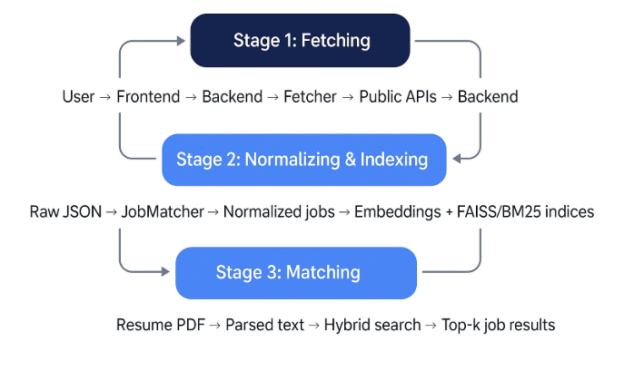

# Design

Component responsibilities and the data model. See the README for the
architecture overview and the reasoning behind hybrid retrieval.

## Where each component runs

The three "services" are not deployed the same
way: only the job fetcher runs in AWS Lambda. The user service and job matcher
are Python modules imported in-process by the FastAPI app.

| Component | Runs as | Entry point |
|---|---|---|
| Job fetcher | Lambda, on a schedule | `lambda_function.handler` |
| Job matcher | In-process module | `services/job_matcher/job_matcher.py` |
| User service | In-process module | `services/user_service/user_service.py` |
| API | uvicorn process on EC2 | `services/api.py` |

## Job fetcher

Calls the three source APIs (JSearch, USAJOBS, Grants.gov) and returns raw JSON
per source. It does no normalization — raw payloads land in S3 so they stay
replayable if the parsing logic changes later.

Each source is fetched independently and a failure is logged rather than
raised, so one rate-limited or expired key does not block the others.
`services/ingestion.py` wraps this with the S3 upload and returns a per-source
status map.

## Job matcher

1. Loads the raw JSON dumps and normalizes each listing to a common shape
   (title, company, location, description, source).
2. Chunks the text and embeds it with a sentence-transformers model, indexed in
   FAISS.
3. Parses an uploaded résumé PDF with PyMuPDF and uses its full text as the
   query.
4. Ranks listings through the hybrid retriever: BM25 and vector search fused by
   `alpha` weighting, with optional graph expansion and cross-encoder
   reranking.

Retrieval lives in `services/job_matcher/src/`. The score normalization and
fusion step is isolated in `scoring.py` with no model imports, so it is unit
tested directly.

## User service

Creates accounts, verifies credentials, and reads and updates preferences,
backed by DynamoDB. The frontend never calls it directly — requests go through
the `services/api.py` endpoints, which delegate.

Passwords are stored as salted PBKDF2-HMAC-SHA256 (600,000 iterations) in the
format `pbkdf2_sha256$<iterations>$<salt>$<hash>`. Accounts created before
salted hashing hold a bare SHA-256 digest; those still verify and are
transparently re-hashed on the next successful login, so no one is locked out
by the change.

## DynamoDB users table

Partition key: `email` (string). No sort key.

```json
{
  "email": "name@example.com",
  "password_hash": "pbkdf2_sha256$600000$<salt>$<hash>",
  "default_title": "data scientist",
  "default_location": "Los Angeles, CA",
  "remote_pref": "Yes",
  "role": "user | admin",
  "created_at": "2025-12-14T00:00:00+00:00",
  "updated_at": "2025-12-14T00:00:00+00:00"
}
```

`password_hash` is stripped from every API response.

Note that `role` is read by the frontend to decide whether to show the admin
view. That is a convenience, not a security control — the API does not enforce
it. See the README's Limitations.

## Ingestion data flow

<p align="center">
  
</p>

S3 keys are `<prefix><source>_<UTC timestamp>.json`, for example
`raw_data/jsearch_20251214_093000.json`. The API reads the most recently
modified key per source, so older dumps accumulate as history without
affecting what is served.
